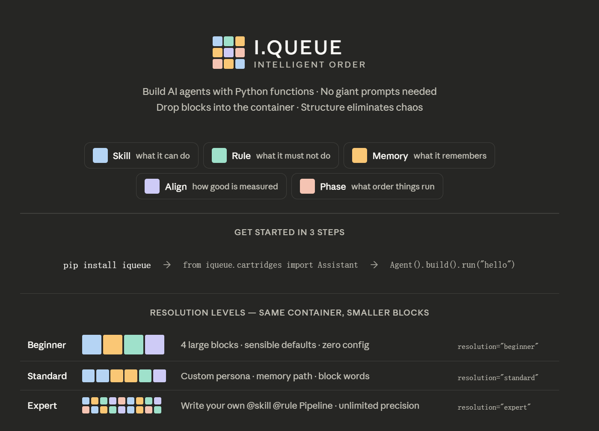
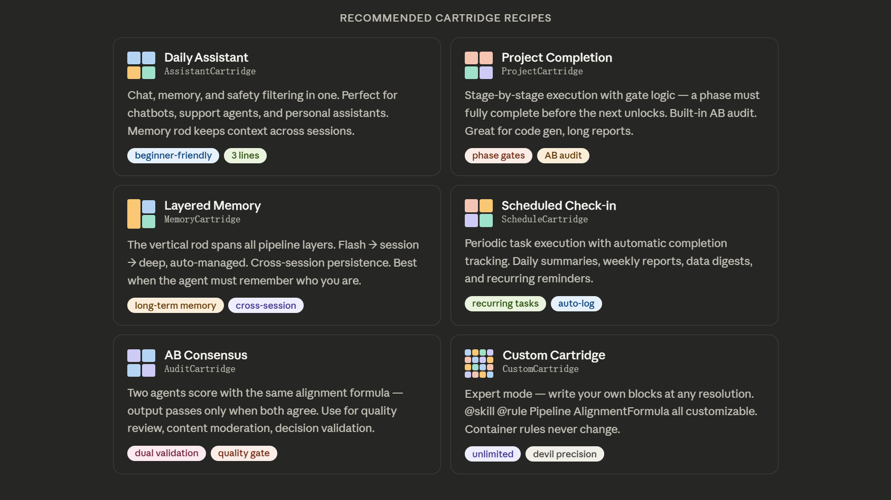

# I.QUEUE

<div align="center">

**Your AI Guardian**

[](https://python.org)
[](LICENSE)
[]()

**Download → Click → Done**

[🚀 Quick Start](#quick-start) — [📖 Docs](#documentation) — [💬 Guide](#how-it-works)

</div>

---

## Visual Overview

### How It Works



### Pre-Built Cartridges



---

## What is I.QUEUE?

Your AI picks its own:
- **Memory** — How to remember
- **Skills** — What to do
- **Preferences** — How to behave
- **Rules** — What not to break

*You describe once. It configures itself.*

---

## Core Building Blocks

| Element | Visual | Meaning | Purpose |
|---------|--------|---------|---------|
| **Memory** | 📦 | "I remember our agreement" | Persistent knowledge layer spanning all stages |
| **Skills** | 🛠️ | "My new skill learned" | Capabilities defined as Python functions |
| **Preferences** | ⚙️ | "I prefer your way" | Behavioral parameters and priorities |
| **Rules** | ✓ | "What I must/must not do" | Constraints and safety boundaries |

These four elements combine to form your Agent pipeline:
- **Input Processing:** Skills + Memory → Context Preparation
- **Reasoning:** Mix with Preferences & Rules → Decision Making
- **Output:** Final Composition → Agent Response

---

## Quick Start

```bash
# 1. Install
pip install -r requirements.txt

# 2. Run
python run.py

# 3. Choose Mode
#  1️⃣  Full (Web UI + Desktop Monitor)
#  2️⃣  Web Only
#  3️⃣  CLI Guide

# 4. Tell it what you need
# It builds itself. Done.
```

---

## Three Ways to Start

| Method | Command | Best For |
|--------|---------|----------|
| **One Click** | `python run.py` | Full experience |
| **Web Designer** | `python run.py` → Mode 2 | Visual preference |
| **CLI** | `python quick_start.py "your need"` | Quick testing |

---

## How It Works

```
Your Need
   ↓
AI Analysis
   ↓
Auto Configure:
 • Memory
 • Skills
 • Preferences
 • Rules
   ↓
Instant Deploy
   ↓
Desktop Monitor Shows Execution
```

No code. No config files. No headaches.

Just you and your AI.

---

## Features

✅ **Automatic Agent Design** — Describe once, get perfect config  
✅ **Web UI** — Visual designer with real-time preview  
✅ **Desktop Monitor** — Floating panel for real-time execution  
✅ **One-Click Deploy** — From requirement to live agent  
✅ **Skill Library** — Pre-built capabilities ready to use  
✅ **Export** — Save as Markdown or YAML  

---

## Built-in Skills

- **DailySummarizer** — Auto summarize daily work
- **NewsCurator** — Collect and organize news
- **ReportGenerator** — Create professional reports

*Build custom skills in Python—just write functions.*

---

## Technology Stack

- **Backend:** FastAPI + Python 3.10+
- **Frontend:** HTML5 + CSS3 + Vanilla JavaScript
- **Desktop:** PyQt6
- **Config:** YAML

---

## Documentation

- [📖 Quick Start Guide](./I.QUEUE/STARTUP_GUIDE.md)
- [🛠️ Skills Guide](./I.QUEUE/SKILLS_GUIDE.md)
- [⚙️ AutoDesigner Guide](./I.QUEUE/AGENT_AUTODESIGNER_GUIDE.md)

---

## What's Next?

```
1. Download
2. Click
3. Your AI Guardian Appears
```

No waiting. No code. No stress.

Just intelligence. Order. Forever.

---

<div align="center">

**[Download Now](#quick-start)** — **[Read Docs](#documentation)** — **[Try Online](./I.QUEUE/web_ui/)**

</div>
def understand_intent(text: str) -> dict:
    """Extract user intent from input."""
    return {"intent": "...", "confidence": 0.95}

# A rule = an executable constraint
@rule(name="no_harmful_output", severity="block")
def check_safety(output: str) -> tuple[bool, str]:
    is_safe = not contains_harm(output)
    return is_safe, "Output violates safety policy"

# Pipeline = explicit execution order
pipeline = Pipeline([
    Phase("input_analysis", understand_intent),
    Phase("reasoning", chain_of_thought),
    Phase("output_formatting", format_response),
])

# Alignment = quantifiable scoring formula
alignment = AlignmentFormula([
    AlignmentDimension("safety", weight=0.40, scorer=safety_scorer),
    AlignmentDimension("helpfulness", weight=0.35, scorer=help_scorer),
    AlignmentDimension("conciseness", weight=0.25, scorer=brief_scorer),
])

# Assemble the agent
agent = Agent(
    name="MyAgent",
    pipeline=pipeline,
    alignment=alignment,
    llm_backend="openai"
)

# Run it
result = agent.run("What is machine learning?")
print(result.output)
print(f"Alignment score: {result.alignment_score}")
```

---

## Core Building Blocks

| Block | Represents | Purpose |
|-------|-----------|---------|
| **Skill** | Function + metadata | Define capabilities as code |
| **Rule** | Constraint logic | Executable guardrails |
| **Pipeline** | Explicit stages | Structure execution flow |
| **Alignment** | Weighted formula | Quantified value scoring |
| **Memory** | Layered storage | Flash → session → persistent |
| **Cartridge** | Pre-built preset | Quick start configurations |

---

## Key Advantages

| Aspect | Traditional | I.QUEUE |
|--------|-----------|---------|
| Skill Definition | Text descriptions | Python functions |
| Rule Management | Config files | Code constraints |
| Execution Flow | Hidden in prompts | Explicit pipeline |
| Alignment | Vague guidelines | Computed formula |
| Debugging | Nearly impossible | Stage-by-stage tracking |
| Version Control | Hard to diff | Full git support |
| Testing | Manual | Automated |

---

## Quick Start

### 1️⃣ Download the Project

```bash
git clone https://github.com/zhouyunhong2025-cloud/XIAOJIE.git
cd XIAOJIE/I.QUEUE
```

### 2️⃣ Install Dependencies

```bash
pip install -r requirements.txt
pip install fastapi uvicorn  # For Web UI
```

### 3️⃣ Choose Your Way

#### 🎨 **Way 1: Web Designer (Recommended)** — No code needed!

```bash
python web_server.py
```

Then open **http://localhost:8000** in your browser.

**What you see:**
- Left: Drag-and-drop component library (Tetris-style)
- Top-right: Natural language input ("Summarize my work")
- Bottom-right: Auto-generated Agent design
- One-click deploy ✨

#### 💻 **Way 2: CLI** — Power users

```bash
python quick_start.py "Your requirement here"
```

Example:
```bash
python quick_start.py "帮我总结今天的工作"
# Generates: agent_plan_YYYYMMDD_HHMMSS.md + config.yaml
```

#### 🐍 **Way 3: Python Code** — Custom designs

```python
from agent_auto_designer import AgentAutoDesigner

designer = AgentAutoDesigner()
plan = designer.design_agent("Summarize my daily work")
print(plan.to_markdown())  # View complete plan
```

---

## 🎮 Web Designer UI

### Features:

✅ **Zero-Coding Design** - Describe in plain language
✅ **Intelligent Analysis** - Auto-selects optimal Skills & memory
✅ **Visual Component Picker** - Drag-drop Tetris-style blocks
✅ **Professional Reports** - Auto-generated design documents
✅ **One-Click Export** - Markdown + YAML formats
✅ **Live Deployment** - Start your Agent instantly

### How It Works:

```
1. Type your requirement
   "Summarize reports + track metrics"
         ↓
2. Click "智能分析" (Smart Analyze)
         ↓
3. Review auto-generated design
   - Recommended Skills
   - Memory configuration
   - Alignment priorities
   - Deployment plan
         ↓
4. Customize (optional)
         ↓
5. Click "🚀 一键启动" (One-Click Deploy)
         ↓
✅ Agent running!
```

### Try the Interactive Demo

[🎮 **Live Tetris Demo** - See Agent Assembly in Action](https://zhouyunhong2025-cloud.github.io/XIAOJIE/)

---

## Three Ways to Use I.QUEUE

**Beginner** — Zero config, sensible defaults
```python
from iqueue.cartridges import AssistantCartridge
agent = AssistantCartridge(llm="openai").build()
result = agent.run("Write a summary of quantum computing")
```

**Standard** — Customizable components
```python
agent = Agent(
    skills=[understand_skill, reason_skill],
    rules=[safety_rule, output_rule],
    pipeline=my_pipeline,
    llm_backend="openai"
)
```

**Expert** — Full control
```python
# Write your own @skill, @rule, Pipeline, AlignmentFormula
# Combine them however you want
# Unlimited customization power
```

---

## More Info

- **Full Documentation**: [I.QUEUE Framework Guide](./I.QUEUE/README.md)
- **Live Interactive Demo**: [Tetris Playground](https://zhouyunhong2025-cloud.github.io/XIAOJIE/)
- **Visual Showcase**: [Premium Product Demo](https://zhouyunhong2025-cloud.github.io/XIAOJIE/showcase.html)

---

## Documentation

Full API reference and tutorials in [I.QUEUE/README.md](I.QUEUE/README.md)

- [Core Concepts](I.QUEUE/README.md#core-concepts)
- [API Reference](I.QUEUE/README.md#api-reference)
- [Examples](I.QUEUE/example_agent.py)
- [Advanced Usage](I.QUEUE/README.md#advanced-patterns)

---

## Project Structure

```
XIAOJIE/
├── I.QUEUE/                        # Main package
│   ├── core/
│   │   ├── agent.py               # Agent orchestrator
│   │   ├── skill.py               # @skill decorator
│   │   ├── rule.py                # @rule decorator
│   │   ├── pipeline.py            # Pipeline execution
│   │   ├── alignment.py           # Alignment scoring
│   │   └── memory.py              # Memory system
│   ├── llm/                        # LLM backends
│   │   ├── openai_backend.py
│   │   └── anthropic_backend.py
│   ├── example_agent.py           # Usage demo
│   ├── pyproject.toml             # Package config
│   └── requirements.txt           # Dependencies
├── docs/                          # GitHub Pages
│   └── index.html                 # Live Tetris demo
└── README.md                      # This file
```

---

## What's Next

- [ ] Interactive tutorials
- [ ] More pre-built cartridges
- [ ] PyPI package release
- [ ] GitHub Actions CI/CD
- [ ] Agent templates library
- [ ] Performance optimization

---

## License

MIT License — see [LICENSE](LICENSE)

---

<div align="center">

**Made with care for developers and AI agents.**  
[GitHub](https://github.com/zhouyunhong2025-cloud/XIAOJIE) — [Issues](../../issues) — [Discussions](../../discussions)

</div>
  Agent: DemoAgent
  📦 Skills (3):
     • understand_intent [priority=10]
     • chain_of_thought  [priority=8]
     • format_output     [priority=5]
  ⚖️  Alignment Score: 0.965 (PASS ✅)
╚══════════════════════════════════════╝
```

---

## Project Structure

```
XIAOJIE/
├── I.QUEUE/                        # Main package directory
│   ├── core/
│   │   ├── agent.py               # Agent orchestrator class
│   │   ├── skill.py               # @skill decorator system
│   │   ├── rule.py                # @rule constraint engine
│   │   ├── pipeline.py            # Pipeline execution flow
│   │   └── alignment.py           # Alignment formula calculation
│   ├── llm/
│   │   ├── openai_backend.py      # OpenAI integration
│   │   └── anthropic_backend.py   # Anthropic integration
│   ├── memory.py                  # Memory system
│   ├── example_agent.py           # Complete usage example
│   ├── pyproject.toml             # Project configuration
│   ├── requirements.txt           # Dependencies
│   └── README.md                  # Detailed API docs
├── docs/                          # GitHub Pages deployment
│   ├── index.html                 # Interactive Tetris demo
│   └── showcase.html              # Product showcase page
└── README.md                      # This file
```

---

## Core API

### `@skill` — Define a Skill

```python
@skill(name="translate", tags=["language"], priority=7)
def translate_text(text: str, target_lang: str = "en") -> str:
    """Translate text to target language."""
    return f"Translated: {text} to {target_lang}"
```

### `@rule` — Define a Rule

```python
@rule(name="max_length", severity="warn")
def check_length(output: str) -> tuple[bool, str]:
    ok = len(output) < 1000
    return ok, "Output exceeds 1000 characters"
```

### `Pipeline` — Define Execution Order

```python
pipeline = Pipeline([
    Phase("analyze", analyze_fn),
    Phase("process", process_fn),
    Phase("output", format_fn),
])
```

### AlignmentFormula — 量化对齐

```python
alignment = AlignmentFormula([
    AlignmentDimension("safety", weight=0.40, scorer=safety_scorer),
    AlignmentDimension("helpfulness", weight=0.35, scorer=helpfulness_scorer),
    AlignmentDimension("conciseness", weight=0.25, scorer=conciseness_scorer),
])
```

---

## 📚 详细文档

更多内容和高级用法请查看 **[I.QUEUE/README.md](I.QUEUE/README.md)**

- [API 详细说明](I.QUEUE/README.md#-核心-api)
- [完整示例](I.QUEUE/example_agent.py)
- [配置选项](I.QUEUE/pyproject.toml)

---

## 🔗 相关资源

- 🐍 **Python 3.9+** 支持
- 📦 支持 **OpenAI** 和 **Anthropic** LLM 后端
- 🧠 内置 **记忆系统** 和 **对齐验证**
- 🔧 易于自定义和扩展

---

## 📝 许可证

MIT License - 详见 [LICENSE](LICENSE)

---

## 🤝 贡献

欢迎提交 Issue 和 Pull Request！

---

<div align="center">

**Made with ❤️ by AgentForge Contributors**

</div>
